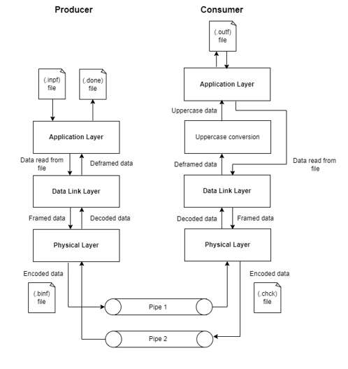

# LayeredPipe

LayeredPipe is a layered inter-process communication (IPC) simulation project designed to mimic network communication between a Producer and Consumer using UNIX pipes. It explores how data can be sent between two processes using different layers of communication, each responsible for specific tasks, similar to how network protocols work.

## Key Features:

Layered Structure: The project is divided into three layers - Application Layer, Data Link Layer, and Physical Layer on both the producer and consumer sides. Each layer performs distinct operations on the data, including framing, encoding/decoding, and application-specific transformations.

Producer:

1.  Reads raw data from an input file (.inpf).
2.  The Application Layer processes this data and sends it to the Data Link Layer, which frames the data for transmission.
3.  The Physical Layer encodes the data into a binary format (.binf) and sends it through Pipe 1 to the consumer process.

Consumer:

1.  Receives the encoded data through Pipe 1.
2.  The Physical Layer decodes the data, and the Data Link Layer deframes it before passing it to the Application Layer.
3.  The Application Layer processes the data (converts it to uppercase) and writes the result to an output file (.outf).

Bi-Directional Communication: A second pipe (Pipe 2) is used to send encoded data back from the consumer to the producer, which can be used for acknowledgment, verification, or feedback.

Simulation of Data Transfer Protocols: Each layer's functionality closely mirrors real-world data transfer protocols (e.g., encoding and framing in physical and data link layers, and application-specific operations in the application layer).

### Flowchart

### Routines used in the program

fork(): The fork() system call creates a new process by duplicating the calling process. The new process is referred to as the child process. The calling process is referred to as the parent process.

pipe(): The pipe() system call creates a pipe, a unidirectional data channel that can be used for interprocess communication. The array pipefd is used to return two file descriptors referring to the ends of the pipe. pipefd[0] refers to the read end of the pipe. pipefd[1] refers to the write end of the pipe.

execlp(): execlp() function duplicate the actions of the shell in searching for an executable.

close(): The close() system call closes a file descriptor, so that it no longer refers to any file and may be reused.

fopen(): The fopen() function opens the filename pointed to, by filename using the given mode.

fclose():The fclose() function closes an open file pointer.

perror(): The perror() function produces a message on standard error describing the last error encountered during a call to a system or library function.

strlen(): The strlen() function calculates the length of the string, excluding the terminating null character.

strcasecmp(): The strcasecmp() function compares string1 and string2 without sensitivity to case. All alphabetic characters in string1 and string2 are converted to lowercase before comparison.

wait(): The wait() system call blocks the calling process until one of its child processes exits or a signal is received. After child process terminates, parent continues its execution after wait system call instruction.

dup2(): The dup2() system function is used to create a copy of an existing file descriptor.

encode(): This function is used to execute all the tasks involved in encoding data.

decode(): This function is used to execute all the tasks involved in decoding data.

removeParity(): This function is used to check and remove parity bit from binary data.

addParity(): This function is used to add parity bit to the 7-bit binary data.

binaryToCharacter(): This function is used to convert 7-bit binary data to character.

characterToBinary(): This function is used to convert a character into binary.

frameData(): This function is used to frame the data i.e, adds SYN and length characters to the data.

deframeData(): This function is used to deframe the data i.e, removes SYN and length characters from the data.

physicalLayer(): This function is used to either encode or decode the data.

dataLinkLayer(): This function is used to either frame or deframe the data.

applicationLayer(): This function is used to either read data from input files or write data to the output files.

toUpperCase(): This function is used to convert all lowercase characters into uppercase.

### Implementation details

The program uses fork(), pipe() and exec() system calls to implement interprocess communication between pair of processes.
The program is developed using C and is implemented as follows:

1.  On running the program, pair of processes (producer and consumer) are created using fork() system call.
2.  Producer process accesses the input file and passes it through the application layer. The application layer reads the contents of files. The data link layer frames the data read from the file. Then, the framed data is then passed through the physical layer, where it is encoded into binary bits - 7 information bits and 1 odd parity bit. The encoded data is the stored in a file with .binf extension.
3.  The encoded data is then passed as an input to the consumer process.
4.  Consumer process decodes the data in the physical layer and passes it through data link layer where it is deframed. The deframed data is converted into uppercase and is stored in a file with .outf extension by the application layer.
5.  Consumer process encodes the data and stores in the file with .chck extension.
6.  The encoded data is now passed as an input to the producer process.
7.  Producer process decodes the data and stores it in a file with .done extension.
8.  Redirection of standard input/output of processes is achieved using dup2(). Commands are executed by the processes created using execlp() function.

### Testing

Requirements:

Compiler : GNU C
System: Linux OS - Ubuntu

Follow the below instructions to run the program:

 Step 1: Open terminal.
 Step 2: Compile and build supporting c files.
    Command: gcc -o physicalLayer physicalLayer.c
    Command: gcc -o dataLinkLayer dataLinkLayer.c
    Command: gcc -o applicationLayer applicationLayer.c
    Command: gcc -o toUpperCase toUpperCase.c
 Step 3: Compile and build source code.
    Command: gcc -o producerConsumer producerConsumer.c
 Step 4: Run the executable/object file and pass the input filename as a command line argument.
    Command: ./producerConsumer winVirus.inpf
 Output: winVirus.binf, winVirus.chck, winVirus.oupf, and winVirus.done files will be generated
